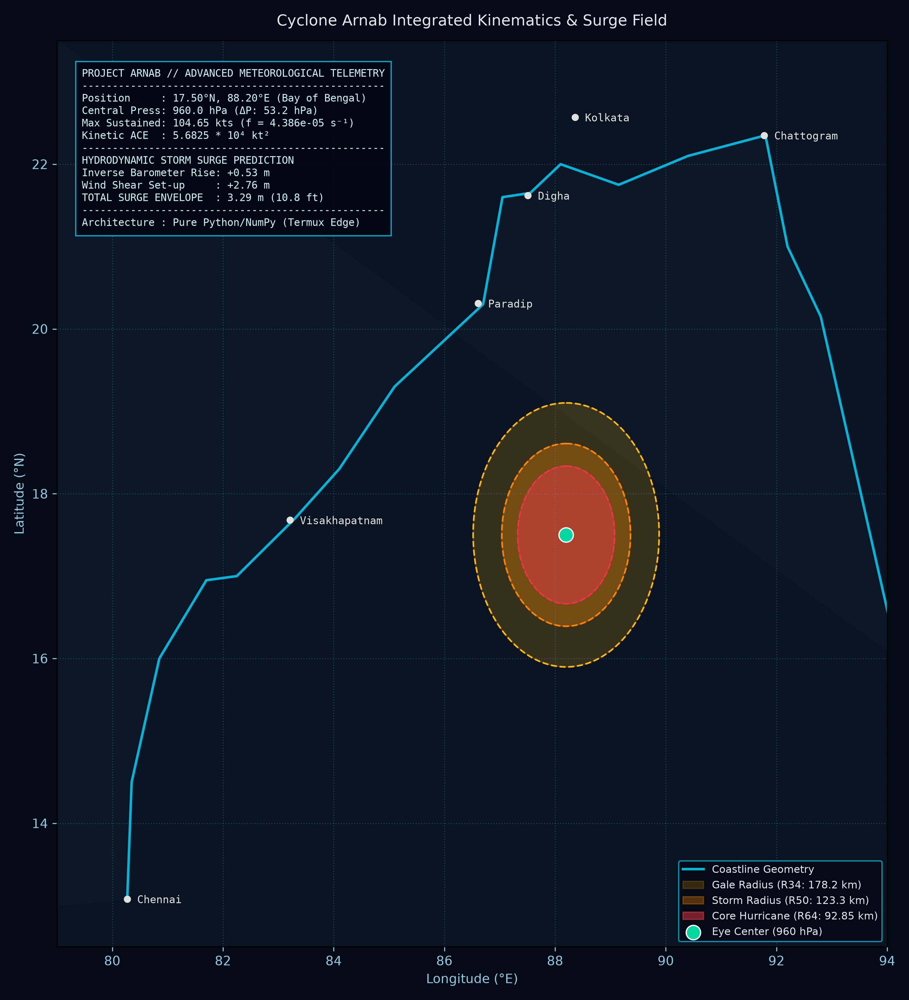

# Project Arnab: Edge-Computing Tropical Cyclone Diagnostic Pipeline
**NASA International Space Apps Challenge 2026**

[-blue.svg)](#)
[](#)
[](#)

Project Arnab is an edge-native tropical cyclone intensity, kinematic field, and hydrodynamic surge modeling pipeline built to run entirely on low-power mobile devices (Android Termux) without external cloud server compute.



---

## Key Scientific Modules

1. **Holland Wind-Pressure Dynamics:**
   Calculates radial pressure $P(r)$ and cyclostrophic gradient wind velocities $V(r)$ using the Holland model integrated with real-time Coriolis acceleration ($f = 2\Omega\sin\phi$).
   
2. **Critical Wind Radii Buffering:**
   Extracts exact operational danger boundaries ($R_{34}$, $R_{50}$, $R_{64}$) and projects spherical geodesic circles on EPSG:4326 using pure spherical trigonometry without heavy GIS dependencies.

3. **Accumulated Cyclone Energy (ACE) Engine:**
   Tracks integrated kinetic release metric:
   $$\text{ACE} = 10^{-4} \sum V_{max}^2 \quad (\text{for } V_{max} \ge 35\text{ kts})$$

4. **Hydrodynamic Storm Surge Estimation:**
   Couples the **Inverse Barometer Effect** ($\eta_{ib} = \frac{\Delta P}{\rho_w g}$) with coastal **Wind Stress Set-up** ($\tau_w = \rho_a C_d V^2$) parameterized for the shallow shelf of the Bay of Bengal.

---

## Directory Structure

```text
project-arnab/
├── assets/
│   └── telemetry_map.png          # High-resolution output map
├── core/
│   └── engine.py                  # Pure NumPy diagnostic pipeline
├── requirements.txt               # Lightweight edge dependencies
└── README.md                      # Technical documentation
Edge Execution
# Clone the repository
git clone [https://github.com/](https://github.com/)<your-username>/project-arnab.git
cd project-arnab

# Install minimal dependencies
pip install numpy matplotlib

# Execute pipeline
python core/engine.py
Built for extreme reliability in disaster management where network access and cloud compute are compromised.
